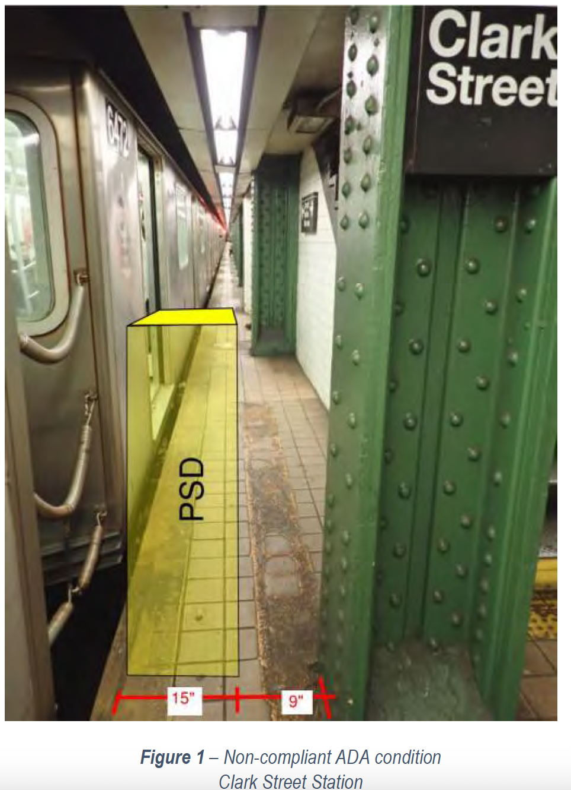
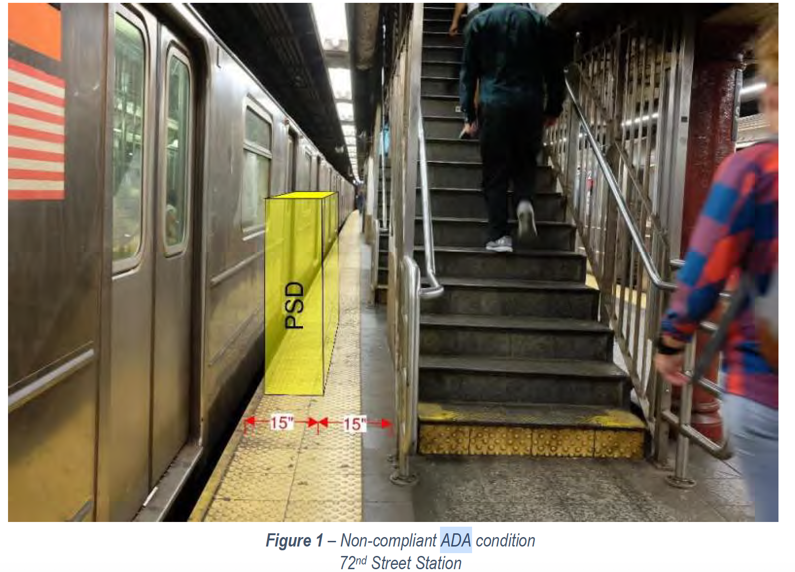
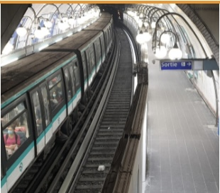

## Complaints about NYC subway safety

NYC subway has a high incidents of track intrusion and people getting struck by trains. See their track intrusion report [https://www.mta.info/document/77166](https://www.mta.info/document/77166). While over 75% of these voluntary, around 12.5% are due to assault as well as accidental or medical slips and falls. The solution to these is implementing platform screen doors seen else where in the world (ie. [rope type platform barriers](https://rsd.bg)). According to MTA's track intrusion report [https://www.mta.info/document/77166](https://www.mta.info/document/77166), they are choosing to address mental health to reduce these incidents but still there are around 12.5% that are accidental or from assault that they are not accounting for. Also, in the report, they should have implemented platform screen door pilot between 2022 and 2024. However, it is 2025 and no one knows what the progress on that is. While I have raised the concern with them many time the reponse that I get from MTA is that "we are exploring options". 

During the week that ended on March 14, 2025, there were five incidents of people being struck by train. Although these were suicide attempts, some of the hazardous conditions in the subways puts everyone at risk. For instance, platform construction forces passengers to wait or walk on or close to their yellow recommended no-step line. See the links below. It is very unacceptable that they would even keep the stations open during construction and expose passengers to life threatening conditions.

* Parkchester: [https://brooklyn.news12.com/parkchester-subway-riders-cite-safety-risks-from-narrow-platform](https://brooklyn.news12.com/parkchester-subway-riders-cite-safety-risks-from-narrow-platform)
* 34th street-Penn station: [https://www.reddit.com/r/nycrail/comments/1hpgbn0/in_what_universe_is_this_safe/?chainedPosts=t3_1jd8tdg&rdt=49017](https://www.reddit.com/r/nycrail/comments/1hpgbn0/in_what_universe_is_this_safe/?chainedPosts=t3_1jd8tdg&rdt=49017)

The subway system also has a lot of sketchy and narrow spots that are hazardous. For instance see the image below from Clark street. This image was captured from their 4000 page platform screen door feasibility study page 385 (see [https://www.mta.info/document/73241](https://www.mta.info/document/73241)). That study is very much a case of cherry picking data so that MTA can make excuses to not make safety improvements. They cited 32 inches is needed for ADA compliance that section is 24 inches even without a platform screen door. The fact that they are to board and off-board trains in that strip of the platform is downright despicable. No one regardless of disability should be standing on or walking through those tight platform sections.

Another example is 72nd street. It is 30 inches without the platform screen door (PSD) and ADA requires 36 inches. If someone tried to roll a wheel chair through that section they would be on the yellow recommened no-step line.

They also cite curved platforms as a reason to not install implement platform screen doors but look at France (see [https://www.clearsy.com/en/railway/the-platform-screen-doors-of-the-line-4-of-paris-is-now-in-operation-in-security/](https://www.clearsy.com/en/railway/the-platform-screen-doors-of-the-line-4-of-paris-is-now-in-operation-in-security/) and image below).

MTA needs to come up with strategies to improve safety at all levels and not waste time producing 4000 pages of excuses.

Finally, in various locations there are large gaps between the trains and platforms that desparately needs to reduced. See below. One solution is platform gap fillers ([https://skpbrand.com/platform-gap-filler/](https://skpbrand.com/platform-gap-filler/)).

* Gap between train and platform:
  * Sheepshead Bay: https://www.reddit.com/r/nycrail/comments/1c84epb/gap_at_sheepshead_bay/?rdt=43517
  * Great Neck: https://abc7ny.com/mind-the-gap-fall-in-woman-falls-on-tracks-lirr/824908/

