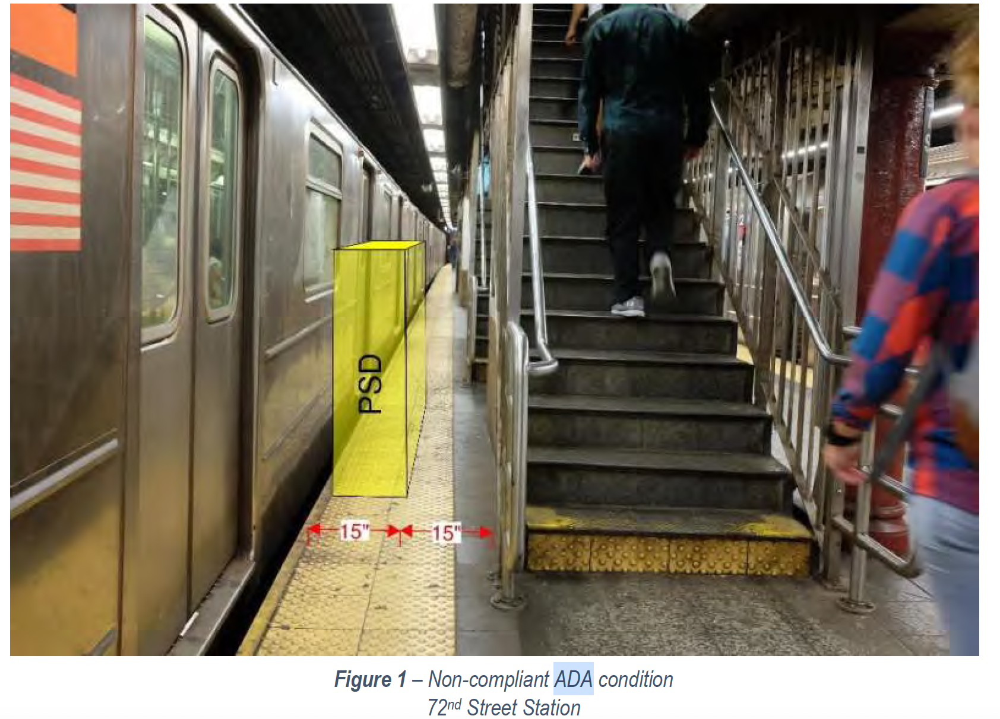
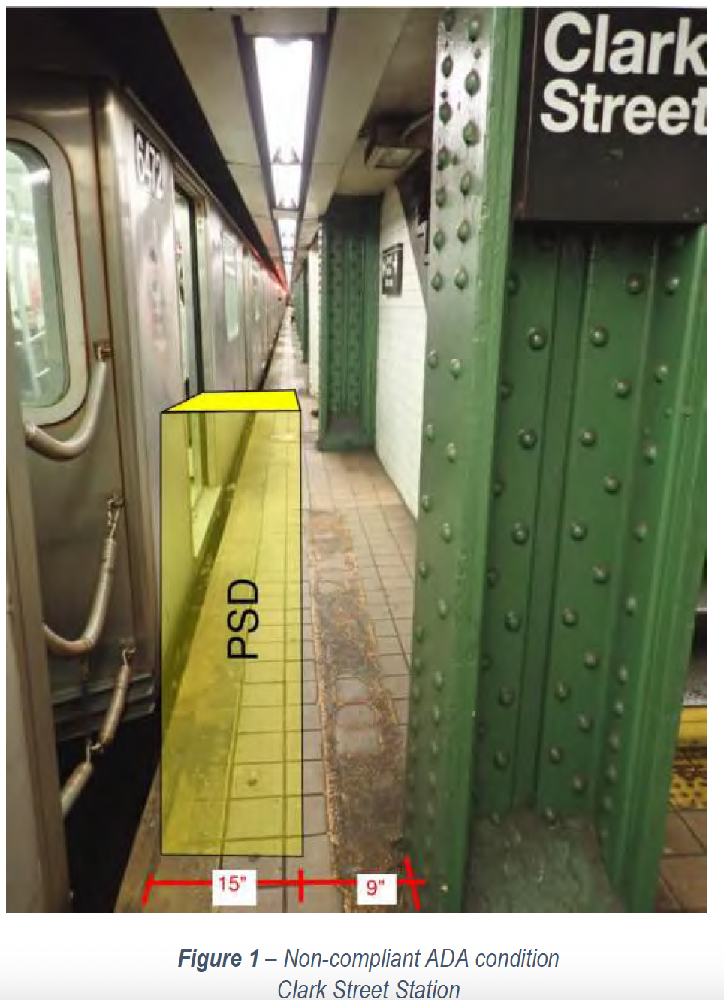

# Rebuttal of NYC MTA Platform Screen Door Feasibility study

Author: Joe Wu, PhD

---

# Background

* These slides will highlight some rebuttals for the NYC MTA’s Platform Screen Door (PSD) feasibility study, which can be found at [https://www.mta.info/document/73241](https://www.mta.info/document/73241).
This report cites many reasons for why PSDs will not be feasible in the NYC subway systme such as ADA non-compliance.
Examples in the subsequent slides will show that MTA cherry picked data that support the ideas that PSDs are not feasible rather than making an effort to improve safty.

---

# Hoyt street: ADA non-compliance (page 210)

* That section of the platform without the PSD is too narrow for normal passengers to stand or walk on, let alone someone in a wheel chair.
* The pipe is a big obstruction and safety concern as someone may walk on that section of the platform and around the pipe to wait for train effectively walking close to the platform edge.

---

# Chamber street: ADA non-compliance (page 68)

* Platform too narrow for passenger traffic.

---

# 72nd stree: ADA non-compliance (page 350)

* They cite 36 inches the minimum ADA requirement.
* At 30 inches (15+15) this section of the platform was not compliant with ADA in the first place and is to narrow for passenger traffic regardless of disability status. One foot will touch the yellow no-step line if someone were to walk through that strip of the platform, which goes against MTA's public safety announcement.
* A person in a wheel chair will not be descending to the platform using the stairs.

---

# Wall street: ADA non-compliance (page 357)

* They cite 36 inches the minimum ADA requirement.
* At 32 inches (15+17), this section of the platform was not ADA compliant in the first place. In addition, the column would have gotten in the way of a wheel chair.
* A wheel chair bound person will not descend to the platform using the stairs.
* This section the platform is too narrow for any passenger to stand or walk through. Trying to walk around the column will lead to a disasterous accident.

---

# Clark street: ADA non-compliance (page 358)

* A minimum of 32 inches was cited for ADA compliance.
* At 24 inches, along with the columns, this area of the platform is not ADA compliant even in the absence of PSD. It is too narrow and dangerous for anyone to wait or walk through this area.

---

# 14th street: Egree non-compliance (page 51)

* Cited narrow and dangerous section of the platform (passengers do not have much space, maybe 2.5 feet at best before the recommended yellow no step line).
* Cited minimum of 5 feet 11 inches evacuation but the existing width of that section of the platform is already non-compliant, even without the PSD.

---

# Columns close to the edge (page 177)

* Consider placing placing rope type platform barrier adjacent to the columns in between the column and the wall. You can potentially customize the length of the rope so that motors that raise these barriers do not need to be placed at every column.  

---

# Conclusions

* It seems that MTA has picked to worst spots on the platforms to support their idea that platform screen doors/barriers are not feasible.
* MTA perhaps would like to keep status quo, keep hazardous conditions, and foster an environment that opens the opportunity for passengers to partake in behavior that goes against their public safety announcement (ie. walk or wait on narrow sections of the platforms).

---

# Recommendation

* MTA needs to be held accountable and forced to formulate solutions to better subway safety either by 
  * Implementing technology such as platform screen doors
  * Changing in standard operating procedures
      * Reduce crowing on platforms
      * Hold passengers behind fare gate until train has stopped at the platform
      * Make train stop before entering the station so that operator can process what is ahead
  * Ban people from walking or waiting in narrow sections of platforms